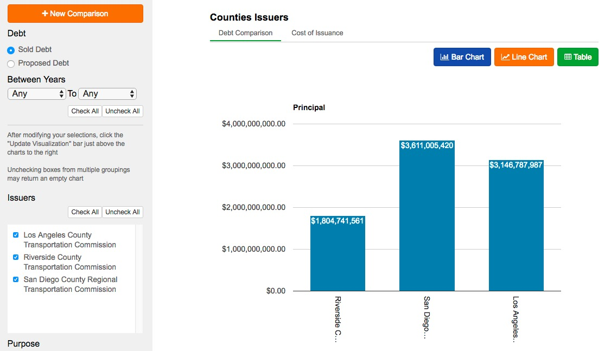

## Socrata-DebtWatch

This is a Ruby on Rails/Angular JS app that NIRD/Socrata built for Socrata for the [CA Treasurer's Office's DebtWatch program](http://debtwatch.treasurer.ca.gov/).

[](http://debtwatch.treasurer.ca.gov/debt-comparison#?type=type&value=Counties&issuers=Riverside%20County%20Transportation%20Commission&issuers=San%20Diego%20County%20Regional%20Transportation%20Commission&issuers=Los%20Angeles%20County%20Transportation%20Commission)


### JavaScript Tests

To run Jasmine tests and see JavaScript test coverage, run `rake teaspoon`.

### VCR

This application uses VCR to mock API calls. When the API changes, delete the `/spec/vcr_cassettes/` directory and re-run the test suite to generate new cassettes.

In order to run the tests without using or changing cassettes run this command:
`USE_VCR=false rspec`

NOTE: There are some VCR cassettes that have been altered by hand to provide specific data to the tests, because mocking it in other ways was not possible. If these are re-recorded, the associated tests will break. They are set-coi-to-nil.yml` and `set-coi-to-null.yml`.

### Figaro

This application uses [Figaro](https://github.com/laserlemon/figaro) to store tokens, usernames, passwords, etc. The `config/application.yml` file where this sensitive data is stored is not stored in git, so it must be shared manually.

When setting up this application. Look at `config/application.yml.example` and make sure you get the keys for all fields, as Figaro will raise an error during initialization if the required keys are not set. Make your own `config/application.yml` file following this example structure.

#### Setting Figaro Variables on Heroku

Using the figaro command, you can set values from your configuration file all at once:

```
$ figaro heroku:set -e production
```

For more information:

```
$ figaro help heroku:set
```
### Clear Cache as Necessary

```rake tmp:clear```
Will clear data from cache. Run this when updating the code in such a manner that changes in the response (data or structure) would be expected.
